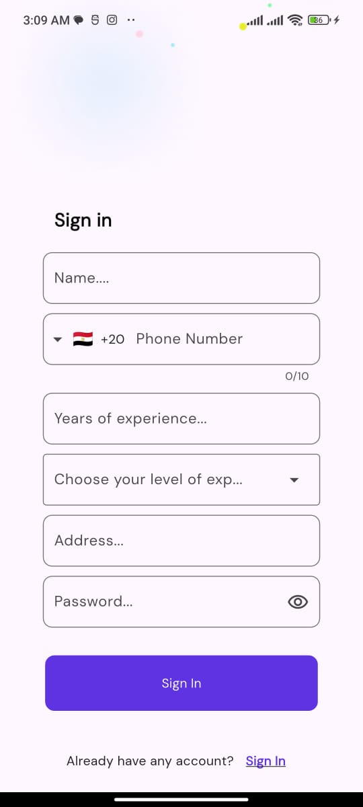
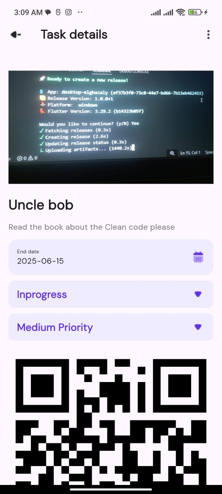
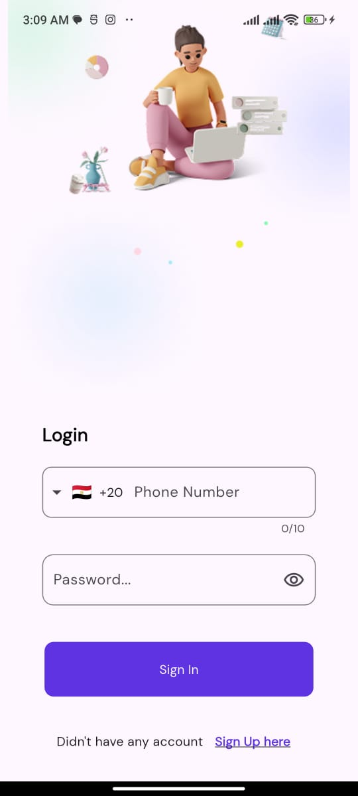
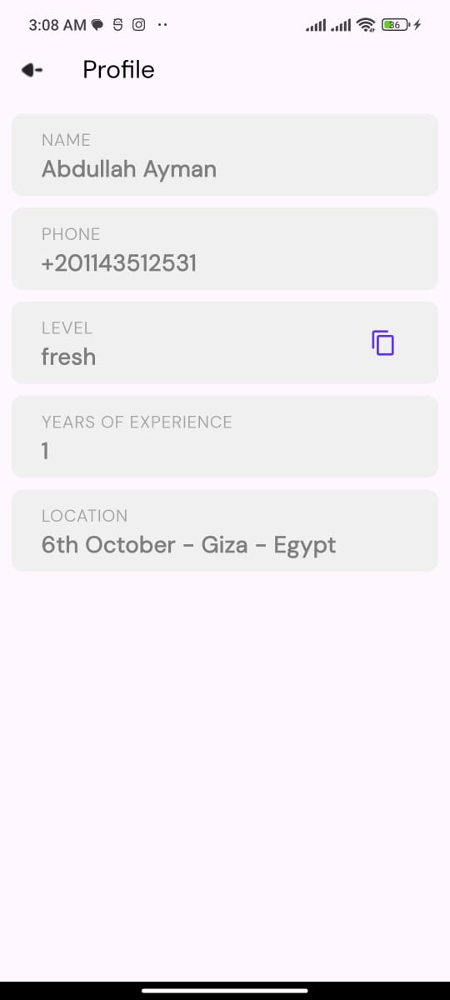
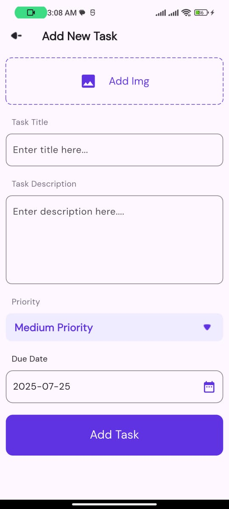
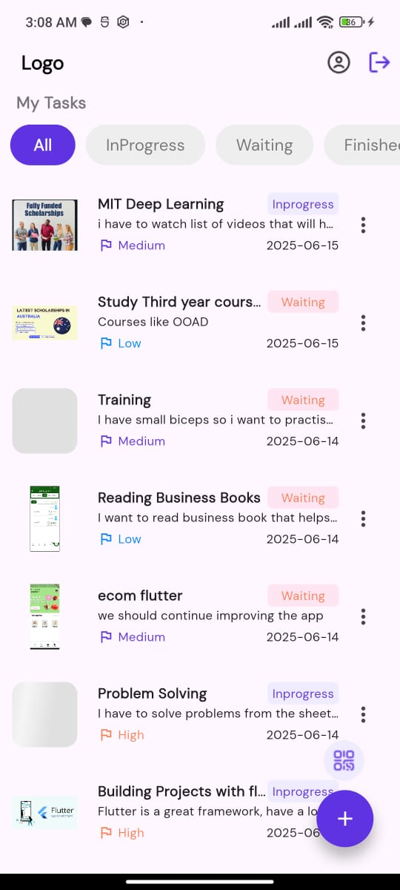
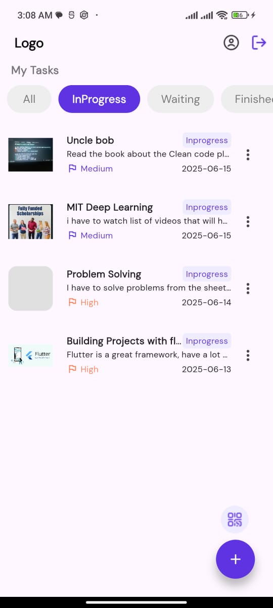

# Introduction
- Introducing Tasky , An Advanced Task Manager Application, Which provides enjoyable UI and a great User Experience
## Features
- Implemented MVVM Architecture
- Users Can Scan Tasks using their QR Code
- Pagination is implemeneted to prevent heavy loading on the app which makes the UX bad
- Used a Backend Api to store the Users Data , and His tasks
- Most important screens are implemented:  
- Login Page  
- Sign up Page  
- Home Page (You have tabs to fetch the tasks by Category)
- Profile Page
- Add/Edit Task Page
- Task Details Page

## Screenshots
Here are some screenshots from the project:

